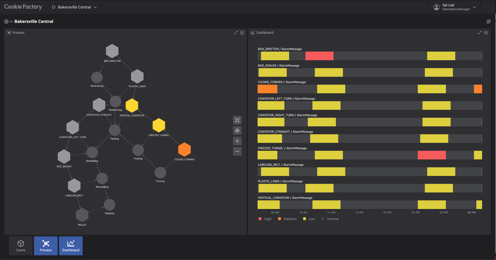

# AWS IoT TwinMaker Getting Started - Bakersville Cookie Factory Digital Twin Monitoring Application

## Summary

This project walks you through the process of setting up the Bakersville Cookie Factory Digital Twin Monitoring Application powered by AWS IoT TwinMaker. 



## Prerequisites

1. CDK version 2.68.0 or higher + an AWS account that has been [bootstrapped for CDK](https://docs.aws.amazon.com/cdk/v2/guide/bootstrapping.html)
2. Node.js 16.x or higher
3. NPM 8.x or higher
4. AWS CLI version 1.27.2 or higher
5. Docker version 20.10.16 or higher

---

## Setup / Test

1. Create a TwinMaker workspace
   1. Console instructions
      1. Go to https://us-east-1.console.aws.amazon.com/iottwinmaker/home
      2. Click "Create Workspace"
      3. Enter a workspace name of your choice and note it down (will be supplied to later commands below)
      4. Under "S3 bucket", select "Create an S3 bucket"
      5. Under "Execution Role", select "Auto-generate a new role"
      6. Click "Skip to review and create"
      7. Click "Create workspace". Note the name of the created S3 bucket (will be supplied to later commands below)
2. Setup application AWS resources (e.g. AWS IoT TwinMaker, Sample Lambdas, Sample Data, etc.)
    - Prepare environment (run from the same directory as this README)
      ```
      cd cdk
      
      npm install
      
      aws ecr-public get-login-password --region us-east-1 | docker login --username AWS --password-stdin public.ecr.aws
      ```
    - Deploy CDK stack containing application resources. Fill-in parameters based on your AWS IoT TwinMaker workspace and preferred stack name.
      ```
      cdk deploy \
        --context stackName="__FILL_IN__" \
        --context iottwinmakerWorkspaceId="__FILL_IN__" \
        --context iottwinmakerWorkspaceBucket="__FILL_IN__"
      ```
3. (optional) Sample calls to validate resources created
    - UDQ
      ```
      aws iottwinmaker get-property-value-history \
          --region us-east-1 \
          --cli-input-json '{"componentName": "CookieLineComponent","endTime": "2023-06-01T00:00:00Z","entityId": "PLASTIC_LINER_a77e76bc-53f3-420d-8b2f-76103c810fac","orderByTime": "ASCENDING","selectedProperties": ["alarm_status", "AlarmMessage", "Speed"],"startTime": "2022-06-01T00:00:00Z","workspaceId": "__FILL_IN__", "maxResults": 10}'
      ```
    - Knowledge Graph
      ```
      aws iottwinmaker execute-query --cli-input-json '{"workspaceId": "__FILL_IN__","queryStatement": "SELECT processStep, r1, e, r2, equipment     FROM EntityGraph     MATCH (cookieLine)<-[:isChildOf]-(processStepParent)<-[:isChildOf]-(processStep)-[r1]-(e)-[r2]-(equipment), equipment.components AS c     WHERE cookieLine.entityName = '"'"'COOKIE_LINE'"'"'     AND processStepParent.entityName = '"'"'PROCESS_STEP'"'"'     AND c.componentTypeId = '"'"'com.example.cookiefactory.equipment'"'"'"}'
      ```
    - Open scene in console: `https://us-east-1.console.aws.amazon.com/iottwinmaker/home?region=us-east-1#/workspaces/__FILL_IN__/scenes/CookieFactory`

4. Setup Web Application
   - Follow instructions in [CookieFactoryDemo](./CookieFactoryDemo/README.md)

## Cleanup

1. Delete resources using CDK (note: can also be done in AWS Console / CLI against the CloudFormation stack)
    - cdk destroy
        ```
        cdk destroy \
          --context stackName="__FILL_IN__" \
          --context iottwinmakerWorkspaceId="__FILL_IN__" \
          --context iottwinmakerWorkspaceBucket="__FILL_IN__"
        ```
2. Delete any Cognito-related resources setup for the demo if needed

---

## License

This project is licensed under the Apache-2.0 License.
